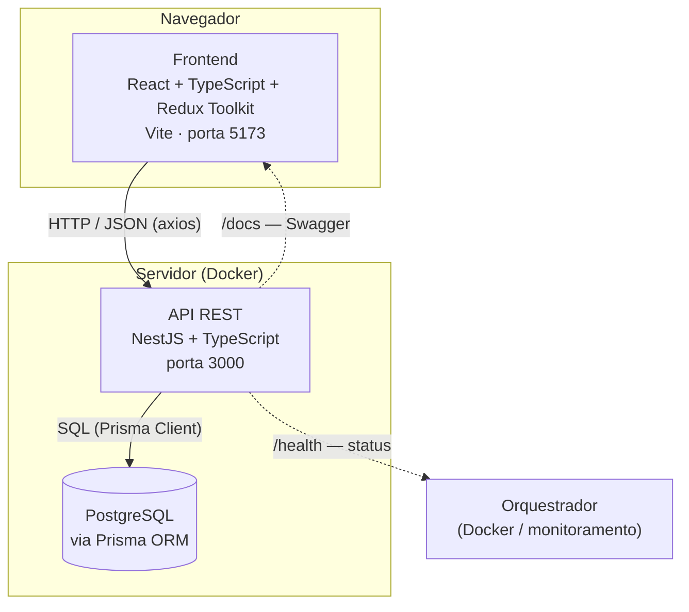
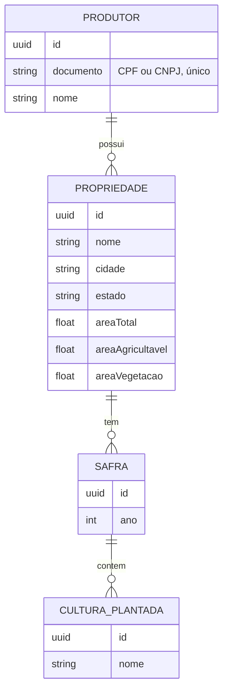
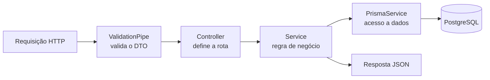

# Brain Agriculture

Sistema de gerenciamento de cadastro de produtores rurais, propriedades, safras e culturas plantadas, com dashboard de indicadores.

Projeto full-stack desenvolvido como teste técnico: backend em NestJS + Prisma + PostgreSQL, frontend em React + TypeScript + Redux Toolkit.

## Estrutura do repositório

```
brain-agriculture/
  backend/    # API REST (NestJS + Prisma + PostgreSQL)
  frontend/   # Interface web (React + Redux + styled-components)
```

Cada pasta tem seu próprio README com instruções detalhadas de instalação, execução e testes.

## Deploy

- **Frontend**: [URL da Vercel]
- **Backend**: [URL da Render] — documentação Swagger em `/docs`, health check em `/health`

> O backend está no plano gratuito da Render, que "dorme" após 15 minutos sem uso — a primeira requisição depois de um tempo parado pode demorar de 30 a 60 segundos pra responder. Isso é uma limitação do plano gratuito, não um bug da aplicação.

## Como rodar o projeto completo

1. Suba o backend (veja `backend/README.md`) — ele expõe a API em `http://localhost:3000` e a documentação Swagger em `http://localhost:3000/docs`.
2. Suba o frontend (veja `frontend/README.md`) — ele expõe a interface em `http://localhost:5173` e já vem configurado para consumir a API local.

## Tecnologias

**Backend:** NestJS, Prisma ORM, PostgreSQL, Docker, Jest (testes unitários e de integração), Swagger, class-validator.

**Frontend:** React, TypeScript, Redux Toolkit, styled-components, Recharts, Jest + React Testing Library, Atomic Design.

## Arquitetura

### Visão geral do sistema



### Modelo de domínio

Um produtor pode ter várias propriedades; cada propriedade pode ter várias safras; cada safra pode ter várias culturas plantadas.



### Fluxo de uma requisição no backend (arquitetura em camadas)



Cada camada tem uma única responsabilidade — o Controller não sabe de regra de negócio, o Service não sabe de HTTP, e o Prisma não sabe de nenhum dos dois. Essa separação é o que permite testar a regra de área (`validarAreas`) e a validação de CPF/CNPJ isoladamente, sem precisar de banco nem de requisição HTTP real.

## Funcionalidades

- Cadastro, edição e remoção de produtores rurais, com validação de CPF/CNPJ.
- Cadastro de propriedades rurais vinculadas a um produtor, com validação de que a soma da área agricultável e de vegetação não ultrapassa a área total.
- Cadastro de safras e culturas plantadas por propriedade.
- Dashboard com total de fazendas, total de hectares e gráficos de pizza (por estado, por cultura plantada e por uso do solo).
- Health check da API (`/health`) para monitoramento.
